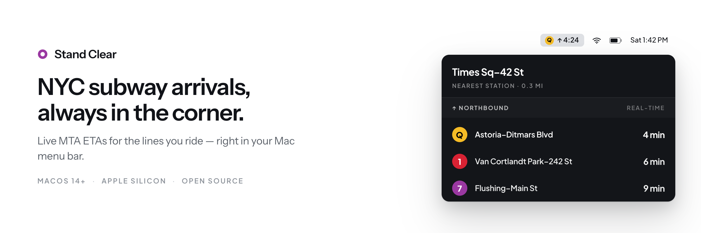

# Stand Clear




A small native macOS menu bar app that finds the closest NYC subway station and shows live ETAs for the lines you care about.

Station metadata and live arrival data come directly from the [MTA developer feeds](https://www.mta.info/developers).

## Contents

- [Features](#features)
- [Requirements](#requirements)
- [Installation](#installation)
- [Usage](#usage)
- [Development](#development)
- [Updating station data](#updating-station-data)
- [Privacy](#privacy)
- [Data and trademarks](#data-and-trademarks)
- [Contributing](#contributing)
- [License](#license)

## Features

- **Nearest stations, live** — shows the five nearest stations that serve your selected lines, with two arrivals each; click a station to expand it for more.
- **One direction at a time** — a direction bar switches the whole board between northbound and southbound; the same choice lives in Settings.
- **Menu-bar countdown pin** — pin a direction to see a live `Q ↑ 4:24`-style countdown in the menu bar for whichever selected line arrives soonest.
- **Two time formats** — floored whole minutes (`4 min`) or a live `4:24` countdown, persisted and switchable with a click on any arrival.
- **Service alerts** — a banner surfaces MTA disruptions on your selected lines, with affected routes rendered as real route bullets; the Settings route grid badges affected lines too.
- **Fast and small** — a compact 340×480 menu with 44‑point rows, refreshing every 30 seconds, built to be light on memory.
- **Automatic updates** — checks for new versions in the background by default; turn that off in Settings → General if you prefer to check manually, then install with one click when an update is available.

## Requirements

- macOS 14 or newer
- Apple silicon — the released DMG is arm64-only
- Xcode 16 or newer, to build from source

## Installation

**[Download the latest DMG](https://github.com/sebastiancrossa/stand-clear/releases/latest/download/StandClear-macos-arm64.dmg)**, open it, and drag Stand Clear into Applications. Earlier versions are on the [releases page](https://github.com/sebastiancrossa/stand-clear/releases).

The DMG is Developer ID signed, notarized, and stapled, so it opens without a Gatekeeper warning. To verify a download, take the versioned DMG and its `.sha256` from the same release — the checksum file names that DMG, not the unversioned alias above, though both hold the same image:

```sh
shasum -a 256 -c StandClear-<version>-macos-arm64.dmg.sha256
```

Later versions install in place from Settings → General; there's no need to download a DMG again.

To build from source instead:

```sh
git clone https://github.com/sebastiancrossa/stand-clear.git
cd stand-clear
make app
open dist/StandClear.app
```

That build is ad-hoc signed rather than notarized, so the first launch needs a right-click → Open. Location permission requires the bundled `.app` either way; running through SwiftPM (`swift run StandClear`) works for development but can't request location access.

Stand Clear is menu-bar-only: after launch, look for the train icon in the menu bar (no Dock icon appears), and allow location access when prompted.

## Usage

On first launch, Stand Clear opens directly to a unified Settings panel with no direction or line selected. Choose one direction and at least one line, then select **Show arrivals** to finish setup. Settings shows the complete subway route catalog, not just the lines at your nearest station, and always keeps at least one line selected so the board never goes empty.

- Click the train icon in the menu bar to open the board; click the gear in the board header to open Settings, even if location is unavailable.
- Click a station header to expand it and see more trains for that stop; only one station stays expanded at a time.
- Click the direction bar to switch between northbound and southbound.
- Click the pin on the direction bar to keep that direction's soonest arrival as a live countdown in the menu bar. The pin follows the nearest station, tracks whichever selected line arrives soonest, advances to the next matching train at zero, shows `--:--` when nothing is upcoming, and is remembered across launches. Unpin from the direction bar's pin or the footer's unpin button.
- Click any arrival's ETA to switch every row between whole minutes (`4 min`) and a `4:24` countdown; your choice is persisted.
- When the MTA is disrupting a selected line, a yellow banner appears above the direction bar — click it to see which trains are affected, when, and why. Alerts at your nearest station (or its transfer stations) sort first; other service-affecting alerts on the line still show. Alerts refresh every five minutes, and a failed fetch leaves the last known alerts in place without affecting live arrivals.

## Development

```sh
swift test
swift run StandClear
```

Local development uses ad-hoc signing via `make app`, so no certificate is required.

## Updating station data

To update the bundled station coordinates from the latest regular MTA static feed:

```sh
make refresh-stops
```

## Privacy

Stand Clear uses Core Location to choose nearby stations. Coordinates stay on the Mac and are never sent to the MTA or any other service.

## Data and trademarks

The repository includes the MTA static GTFS `stops.txt` file and consumes MTA GTFS-Realtime feeds under the MTA's published data terms. The MTA requires a license for public use of its logos, symbols, and other intellectual property; arrange that licensing before distributing this app.

## Contributing

Issues and pull requests are welcome. For anything beyond a small fix, please open an issue first to discuss what you'd like to change.

## License

Stand Clear is available under the [MIT License](LICENSE).
